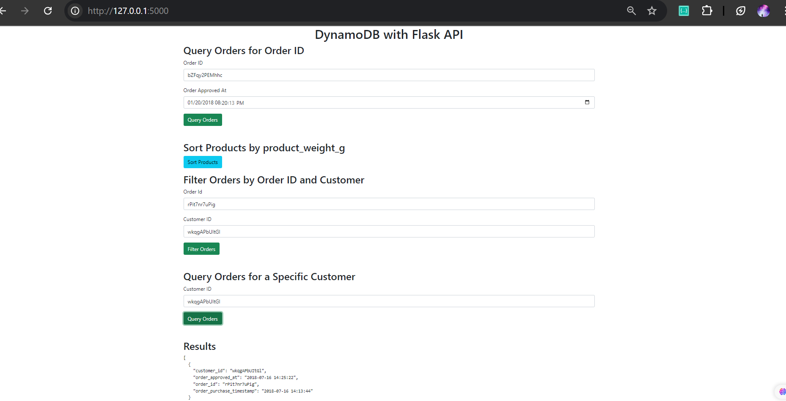

# DynamoDB with Flask API

## Overview
This project is a Flask-based REST API that interacts with a locally hosted Amazon DynamoDB instance. It provides functionality to create tables, import data from CSV files, and perform various queries on the database, such as filtering and sorting.

## Technologies Used
- **Flask**: A lightweight web framework for Python used to build the API.
- **DynamoDB (Local Instance)**: A NoSQL database service that supports key-value and document data models.
- **boto3**: The AWS SDK for Python, used to interact with DynamoDB.
- **HTML/CSS (Bootstrap)**: Used to create a frontend interface for querying the API.
- **CSV**: Used for importing initial data into the database.

## Project Structure
```
|-- dynamo_frontend
|-- app.py           # Main Flask application
|-- templates
|-- index.html       # Frontend UI to interact with API
|-- Data/            # Directory containing CSV files. These files are not provided in repository.
|   |-- df_Products.csv
|   |-- df_Customers.csv
|   |-- df_Orders.csv    
|-- query_time.txt   # Log file for execution time of queries
|-- index.png        # Frontend image
```

## Setup Instructions
### Prerequisites
- Python 3 installed
- Flask and boto3 installed (`pip install flask boto3`)
- DynamoDB Local installed and running (`java -Djava.library.path=./DynamoDBLocal_lib -jar DynamoDBLocal.jar -sharedDb`)

### Running the Project
1. Start DynamoDB Local.
2. Run the Flask application:
   ```bash
   python app.py
   ```
3. Open `http://127.0.0.1:5000/` in your browser to access the frontend UI.

## API Endpoints
### 1. Create Tables
Tables are created manually by uncommenting respective function calls in `app.py` and running it once.
- **`Products`**: Stores product-related information.
- **`Orders`**: Stores customer orders.
- **`Customers`**: Stores customer details.

### 2. Import Data
CSV files are imported into DynamoDB tables by calling `import_data(table_name, file_path)`.

### 3. Query API Endpoints
#### **Query Orders by Order ID and Approval Date**
- **Endpoint**: `/query_orders_product`
- **Params**: `order_id`, `order_approved_at`
- **Example**:
  ```bash
  curl "http://127.0.0.1:5000/query_orders_product?order_id=123&order_approved_at=2023-01-20"
  ```

#### **Sort Products by Product Weight**
- **Endpoint**: `/sort_products`
- **Returns**: Sorted product list by `product_weight_g`.

#### **Filter Orders by Customer and Order ID**
- **Endpoint**: `/filter_orders`
- **Params**: `order_id`, `customer_id`
- **Example**:
  ```bash
  curl "http://127.0.0.1:5000/filter_orders?order_id=123&customer_id=456"
  ```

#### **Query Orders for a Specific Customer**
- **Endpoint**: `/query_customer_orders`
- **Params**: `customer_id`
- **Example**:
  ```bash
  curl "http://127.0.0.1:5000/query_customer_orders?customer_id=456"
  ```

## Execution Time Logging
Execution times for API queries are logged in `query_time.txt` to analyze performance.

## Frontend (index.html)
The web interface provides a user-friendly way to interact with the API:
- Query orders for a product ID.
- Filter orders by customer.
- Sort products.

 

## Future Improvements
- Add authentication for API requests.
- Deploy on AWS with a real DynamoDB instance.
- Improve error handling and data validation.

## Author
Developed by Eman Zahid as part of a Big Data project integrating Flask with DynamoDB.

